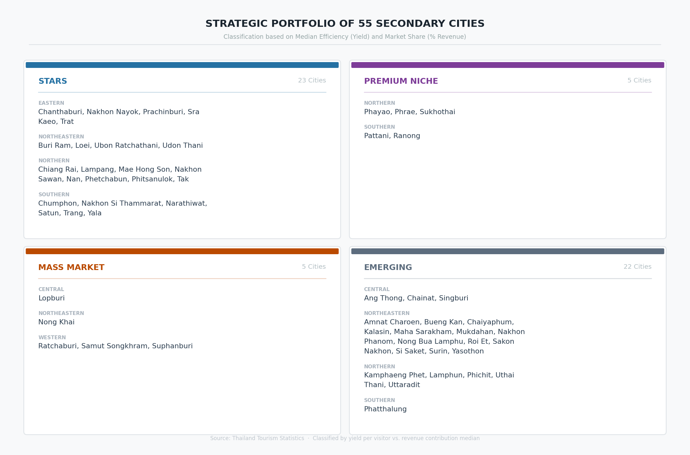

# 🗺️ Strategic Performance and Real Wealth Generation: A Data-Driven Portfolio Analysis of Thailand’s 55 Secondary Cities (2023–2025)

## **Data Source**
1. **Tourism Revenue Data (2023 - 2025):** [Ministry of Tourism and Sports](https://www.mots.go.th/news/category/411)
2. **Consumer Price Index (CPI) Data (2023 - 2025):** [Trade Policy and Strategy Office](https://index.tpso.go.th/document/cpip/post-month)
3. **Digital Intent Data (2023 - 2025):** Aggregated Google Trends for tourism-related keywords.

---

## **Objectives**
This project examines tourism expansion, redistribution effects, and income quality across Thailand. By utilizing static visual analytics and strategic benchmarking, we translate raw tourism data into actionable economic insights to evaluate the real impact on local communities.

---

## **Research Questions**
1. Do secondary cities experience higher tourist growth rates than primary destinations during 2023–2025?
2. Has tourism policy contributed to a genuine redistribution of tourists toward secondary cities?
3. Does tourism development improve income quality (Revenue per tourist)?
4. Can online search interest predict physical tourism demand and revenue?
5. Does tourism growth generate **Real Income** gains for local communities after adjusting for inflation?

---

## **Introduction**
Tourism is a vital driver of Thailand's GDP, but wealth has historically been concentrated in major hubs. While national policies now promote **Secondary Cities** to reduce regional disparities, it remains unclear if visitor growth translates into sustainable economic wealth. This study utilizes **CPI-adjusted Real Revenue** to evaluate whether the "Secondary City Policy" actually improves the purchasing power and livelihoods of local communities.

---

# 01 : Thailand's Tourism: More People, Less Wealth?
### *Decoding the Volume-Value Paradox*

The successful redistribution of visitor volume does not always mirror the growth of economic wealth.

* **The Success (Volume):** Secondary cities reached a peak of **11.2 million visitors** by late 2025.
* **The Struggle (Value):** Despite high volume, secondary city revenue peaked at **35 Billion THB**, while primary hubs captured **248 Billion THB**.

### **Figure 1: Monthly Tourist Arrivals (Volume Analysis)**

  

<strong>Figure 1. Monthly Tourist Arrivals in Primary and Secondary Cities (Jan 2023–Dec 2025)</strong>

### **Figure 2: Monthly Tourism Income (Value Analysis)**

  

<strong>Figure 2. Monthly Tourism Revenue in Primary and Secondary Cities (Jan 2023–Dec 2025)</strong>

> **Key Insight:** On average, a tourist in a major city spends approximately **3.6 times more** than a tourist in a secondary city, highlighting a significant **Yield Gap**.

---

# 02 : The Potential — The Structural Shift
### *Establishing a New Baseline for Thai Tourism*

### **Figure 3: Tourism Redistribution Share**

  

<strong>Figure 3. Market Share Distribution of Tourist Arrivals (2023–2025)</strong>

The data confirms a genuine structural shift. Secondary cities are consistently expanding their baseline share, validating that tourism redistribution policies are decentralizing traveler footprints effectively.

---

# 03 : The Action — Momentum vs. Efficiency
### *Predicting the Surge: Digital Planning Cultures*

### **Figure 4: Bridging the Gap: Digital Planning vs. Physical Footprints**

  

<strong>Figure 4. Online Search Interest and Observed Tourist Arrivals (2023–2025)</strong>

**Lag Analysis Results:**
* **Major Cities:** Short **1-month lead time** (Spontaneous Travel).
* **Secondary Cities:** Longer **2-month lead time** (Planned Exploration).
> **Strategic Window:** Marketing for secondary cities must be launched at least **8 weeks** in advance to capture the planning phase.

---

# 04 : The Reality — Real Wealth Generation
### *Geographic Distribution and Purchasing Power*

All revenue in this section is **Real Revenue**, adjusted by the **Consumer Price Index (CPI)** to reflect true purchasing power.

### **Figure 5: National Wealth Distribution**

  

<strong>Figure 5. Geographic Distribution of Real Tourism Revenue (Average 2023–2025)</strong>

### **Figure 6: Tourism Revenue Ranking Highlights**

  

<strong>Figure 6. Average Annual Real Tourism Revenue Ranking by Province (2023–2025)</strong>

---

# 05: Strategic Portfolio Analysis Results 📊

This phase classifies **55 Secondary Cities** based on **Efficiency (Yield)** and **Market Share (Economic Weight)**.

### 📌 Analytical Framework
> **💡 Key Economic Adjustment:** To ensure accuracy, all revenue data has been adjusted using the **Consumer Price Index (CPI)**. This eliminates inflation distortion and reflects the **Real Income** gained by local communities.

1. **Efficiency (Yield):** Average Spending per Visitor (Baht).

$$Yield = \frac{\text{Real Revenue (Millions)} \times 1,000,000}{\text{Total Visitors (Persons)}}$$

2. **Market Share:** Economic Weight within the secondary tourism sector.

$$\text{Market Share (%)} = \frac{\text{Real Revenue of Province}}{\text{Total Real Revenue of 55 Secondary Cities}} \times 100$$

### **Figure 7: Strategic Position Quadrants**

  

<strong>Figure 7. Strategic Positioning of 55 Secondary Cities based on Real Yield and Market Share</strong>

### **Figure 8: Strategic Portfolio Scorecard**

  

<strong>Figure 8. Strategic Classification and Regional Grouping of Secondary Cities</strong>

---

# 🏁 Final Research Conclusions

| Research Question (RQ) | Final Findings | Supporting Evidence |
| :--- | :--- | :--- |
| **1. Growth Rates** | **YES.** Secondary cities mirror national growth trends with rising volume. | **Figure 1** |
| **2. Redistribution** | **SUCCESSFUL.** Structural shift in market share is visible and sustained. | **Figure 3** |
| **3. Income Quality** | **LAGGING.** Significant **3.6x Yield Gap** persists between city types. | **Figure 2** |
| **4. Digital Predictability** | **YES.** Search intent predicts arrivals with a **2-month lag** for secondary cities. | **Figure 4** |
| **5. Real Income Gains** | **SELECTIVE.** Gains are significant only in **'Stars'**; others face yield challenges. | **Figure 7 & 8** |

---

# 🚀 Strategic Recommendations

* **For ⭐ STARS (e.g., Buri Ram, Sra Kaeo):** Focus on luxury infrastructure and "Premium Branding" to sustain high yields and market dominance.
* **For 💎 PREMIUM NICHE:** Launch targeted digital campaigns 2 months in advance to convert high interest into higher visitor volume.
* **For 🚜 MASS MARKET:** Develop "Value-Added" local packages (e.g., workshops, local crafts) to increase spending per head.
* **For 🌱 EMERGING:** Focus on basic accessibility and infrastructure to move them toward the Mass Market or Premium Niche quadrants.

---