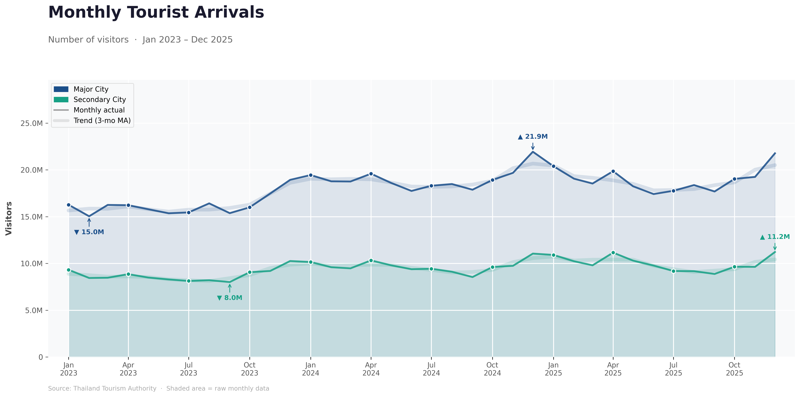
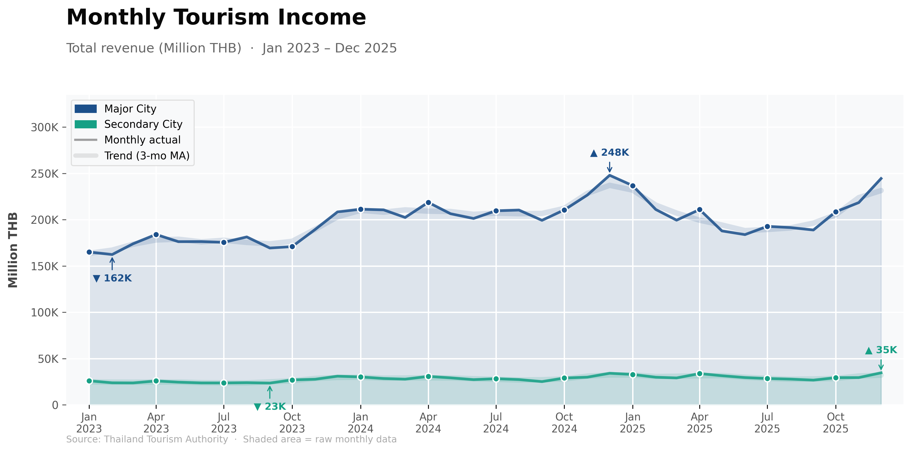
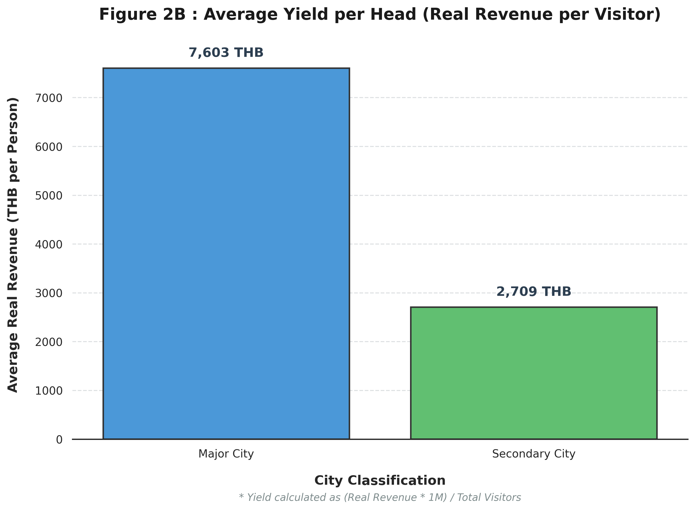
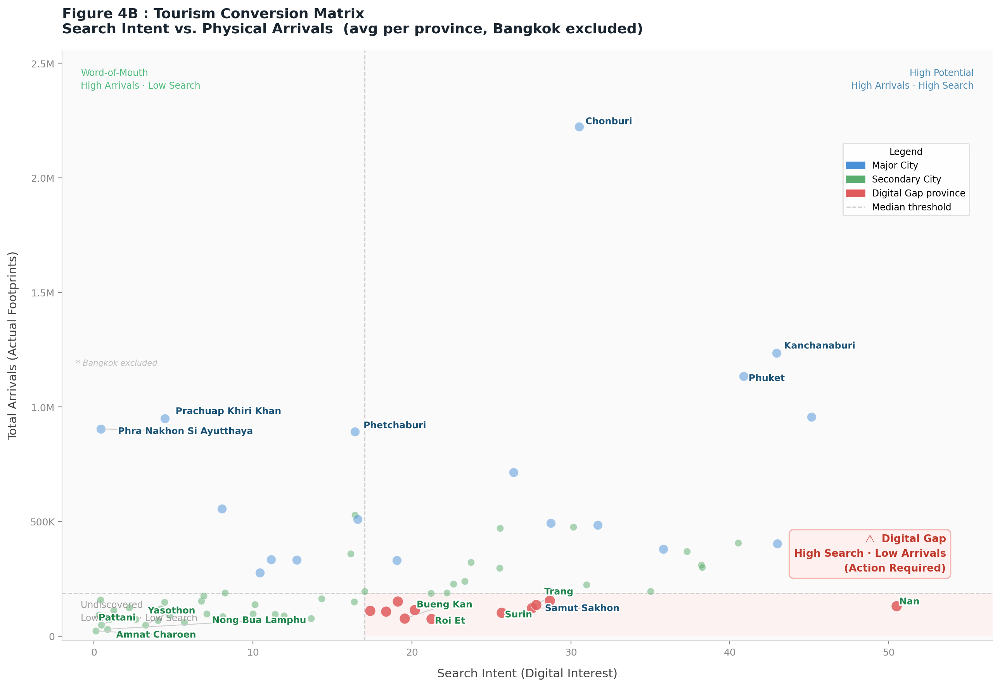
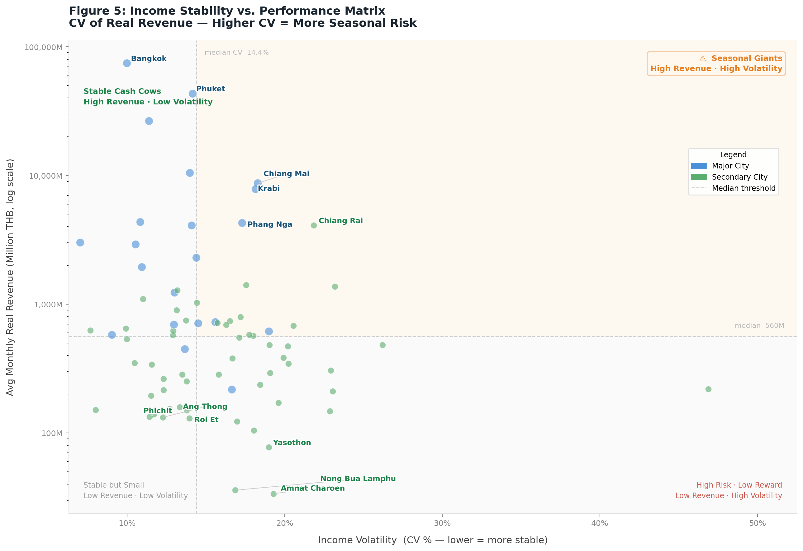
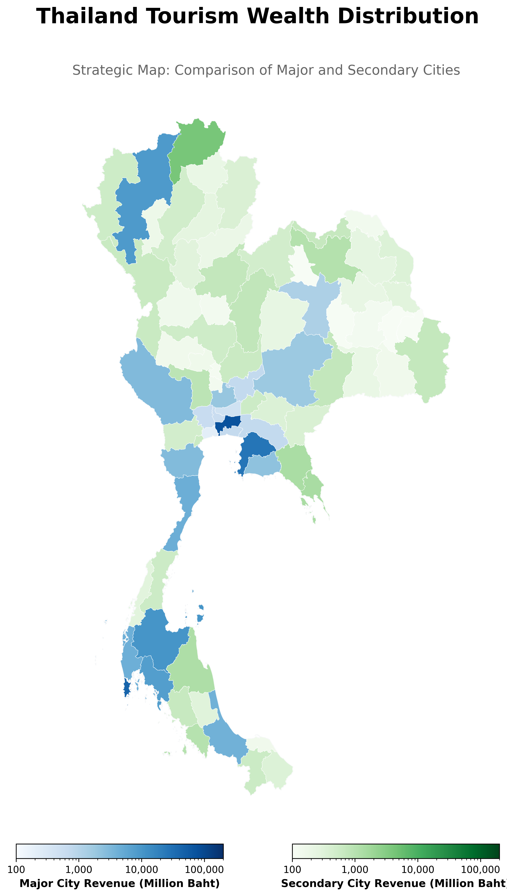
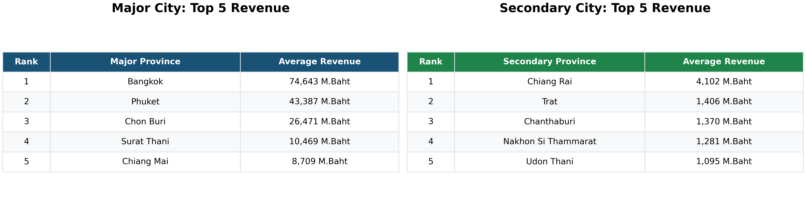
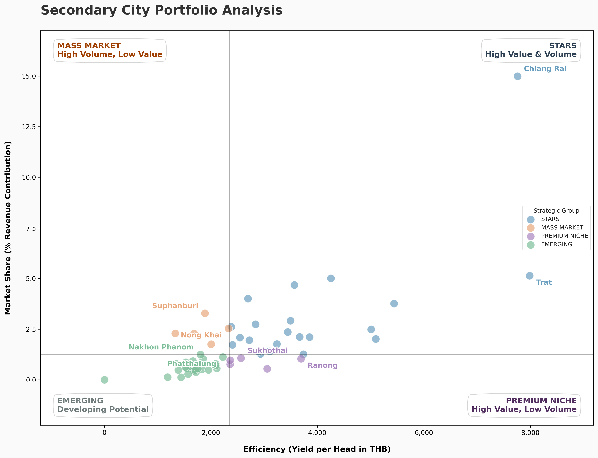

# 🗺️ Strategic Performance and Real Wealth Generation: A Data-Driven Portfolio Analysis of Thailand’s 55 Secondary Cities (2023–2025)

## **Data Source**
1. **Tourism Revenue Data (2023 - 2025):** [Ministry of Tourism and Sports](https://www.mots.go.th/news/category/411)
2. **Consumer Price Index (CPI) Data (2023 - 2025):** [Trade Policy and Strategy Office](https://index.tpso.go.th/document/cpip/post-month)
3. **Digital Intent Data (2023 - 2025):** Aggregated Google Trends for tourism-related keywords.

---

## **Objectives**
This project examines tourism expansion, redistribution effects, and income quality across Thailand. By utilizing static visual analytics and strategic benchmarking, we translate raw tourism data into actionable economic insights to evaluate the real impact on local communities.

---

## **🔍 Research Questions**
### *Defining the Analytical Framework*

To evaluate the true impact of Thailand's tourism policies, this project seeks to answer five core questions using a data-driven approach:

* **1. Growth Performance:** Do secondary cities exhibit significantly higher tourism growth rates compared to primary destinations during the post-pandemic recovery period (2023–2025)?
* **2. Redistribution Effectiveness:** To what extent has the national tourism policy contributed to a genuine geographic redistribution of tourist footprints across Thailand’s 77 provinces?
* **3. Yield & Economic Value:** Does the transition toward secondary cities improve **Yield Efficiency** (Revenue per tourist), and which city tier offers the highest economic value?
* **4. Digital-to-Physical Prediction:** How effectively can online search interest act as a lead indicator for physical demand, and what are the specific **planning windows (Lag)** for different city tiers?
* **5. Real Wealth & Stability:** Does tourism growth generate **Real Income gains** and **long-term Stability** for local communities after adjusting for inflation and seasonality?

---

## **Introduction**

Tourism is a vital driver of Thailand's GDP, but wealth has historically been concentrated in major hubs. While national policies now promote **Secondary Cities** to reduce regional disparities, it remains unclear if visitor growth translates into sustainable economic wealth. This study utilizes **CPI-adjusted Real Revenue** to evaluate whether the "Secondary City Policy" actually improves the purchasing power and livelihoods of local communities.

---

## **Executive Summary**
This research investigates a pivotal economic challenge: **"Can the redistribution of tourist volume effectively generate real wealth for local communities?"** By utilizing **CPI-adjusted Real Revenue**, this project bypasses inflationary noise to uncover the true economic DNA of 55 secondary cities. We transition from simple descriptive statistics to **Predictive Intent Modeling** and **Strategic Portfolio Benchmarking**.

---

## **01 : The Volume-Value Paradox**
### *Success in Arrivals, Struggle in Appropriation*

The first phase of our study addresses the "Paradox of Plenty." While the national policy has successfully decentralized visitor footprints, the economic benefits remain largely anchored in primary hubs.

### **Figure 1: Monthly Tourist Arrivals (Volume Analysis)**

  

<strong>Figure 1. Monthly Tourist Arrivals: Primary vs. Secondary Cities (2023–2025)</strong>

> **🔍 Analytical Deep-Dive: Successful Redistribution**
> Figure 1 proves that the "Secondary City" policy is working in terms of volume. Secondary cities (Green line) now mirror the seasonal spikes of major hubs (Blue line) perfectly. This indicates that travelers are increasingly willing to explore emerging destinations during national "High Seasons." We have successfully moved the "Footprints."

### **Figure 2: Monthly Tourism Income (Value Analysis)**

  

<strong>Figure 2A. Monthly Tourism Revenue: Primary vs. Secondary Cities (2023–2025)</strong>

> **🔍 Analytical Deep-Dive: The Stagnant Wealth Gap**
> Despite the arrival growth, Figure 2 reveals a staggering **3.6x Yield Gap**. Even when visitors increase, the revenue response in secondary cities is disproportionately lower. This suggests these cities currently serve as **"Transit Points"** rather than **"Destination Hubs."** ### **Figure 2b: Yield Efficiency Analysis (Real Revenue per Visitor)**

  

<strong>Figure 2B. Comparative Yield Efficiency: Average Spend per Head (Unit: THB/Person)</strong>

> **🔍 Analytical Deep-Dive: Decoding the Efficiency Gap**
> Figure 2b uncovers the core of the paradox. While Major Cities command a premium spend per visitor, Secondary Cities suffer from low **"Revenue Capture."** > * **The Insight:** It takes nearly **4 tourists** in a secondary city to match the economic contribution of **1 tourist** in a primary city. 
> * **Action Plan:** To bridge this gap, policy must transition from "Volume-Based" to **"Value-Based"**—focusing on increasing the length of stay and providing high-value local experiences that encourage deeper spending in the community.
---

## **02 : The Potential — The Structural Shift**
### *Market Share: Establishing a New Economic Baseline*

### **Figure 3: Tourism Redistribution Share**

  

<strong>Figure 3. Market Share Distribution of Tourist Arrivals</strong>

> **🔍 Analytical Deep-Dive: A Permanent Shift**
> Unlike temporary seasonal spikes, Figure 3 displays a **Steady Expansion** of the secondary city baseline (Green Area). This is evidence of a **Structural Decentralization** in Thai tourism. Secondary cities are becoming a permanent part of the national travel "habit," creating a stable long-term opportunity for local infrastructure investment.

---

## **03 : The Planning to Action Funnel**
### *Synchronizing Timing with Conversion Efficiency*

This section bridges the gap between digital discovery and physical arrival. We analyze the **Discovery Window** (Timing) and the **Conversion Matrix** (Efficiency) to identify structural bottlenecks in the traveler's journey.

### **Figure 4A: Time-Aligned Intent vs. Physical Footprints**

  

<strong>Figure 4A. Predictive Lead-Time Analysis: The Discovery Window</strong>

> **🔍 Analytical Deep-Dive: The "Explorer" planning cycle**
> * **Major Cities (1-Month Lag):** Reflects **"Spontaneous Travel."** High accessibility and familiarity allow travelers to visit almost immediately after searching.
> * **Secondary Cities (2-Month Lag):** Reflects an **"Explorer Culture."** Travelers require a significantly longer **60-day planning window** to research logistics for emerging destinations. 
> * **Strategic Takeaway:** Marketing spend for secondary cities must be front-loaded **at least 8 weeks** prior to peak seasons to capture this initial search intent.

---

### **Figure 4B: Tourism Conversion Matrix**

  

<strong>Figure 4B. Strategic Matrix: Search Intent (Digital) vs. Actual Arrivals (Physical)</strong>

> **🔍 Analytical Deep-Dive: The "Digital Gap" Analysis**
> Using a **Median-based Quadrant Analysis** (excluding Bangkok for statistical integrity), we evaluate the conversion efficiency of each province:
>
> 1. **⚠ The Digital Gap (Red Zone):** These are "Digital Winners" but "Physical Losers." High search intent does not translate to arrivals. This indicates a **Structural Bottleneck**—travelers want to go, but face barriers such as limited transport frequency or insufficient accommodation.
> 2. **💎 Word-of-Mouth (Top-Left):** Provinces where physical popularity exceeds digital planning. These "Hidden Gems" rely on proximity or direct peer recommendations.
> 3. **🚀 High Potential (Top-Right):** Winners that successfully convert high digital interest into high volume.

### **💡 Combined Strategic Action Plan**
* **For Secondary Cities:** Align campaigns with the **8-week Discovery Window** (from Fig 4A) to ensure your message hits when travelers are in the research phase.
* **For Digital Gap Provinces:** Shift policy from *Promotion* to **Accessibility**. Provinces like **Nan** (highlighted in red) do not need more advertising; they need improved road connectivity and transport frequency to bridge the physical gap.
* **Objective:** By optimizing the funnel—timing the campaigns right and fixing the conversion bottlenecks—we maximize the ROI of the national tourism budget.

---

## **04 : Economic Resilience — Income Stability & Risk**
### *Real Income Variance: Measuring the Quality of Growth*

Beyond tourist volume, the **Quality of Income** is defined by its consistency. We analyze the **Real Income Variance** to understand if tourism provides a steady livelihood or a high-risk gamble for local communities. We utilize the **Coefficient of Variation (CV)** as our primary risk metric.

$$CV = \frac{\sigma}{\mu} \times 100$$

### **Figure 5: Income Stability vs. Performance Matrix**

  

<strong>Figure 5. Stability Matrix: Revenue Performance vs. Income Volatility (CV%)</strong>

> **🔍 Analytical Deep-Dive: Decoding the "Risk-Reward" Trade-off**
> * **✅ Stable Cash Cows:** Provinces in the top-left provide consistent, year-round income—the gold standard for sustainability.
> * **⚠️ Seasonal Giants:** High-revenue provinces (Top-Right) that are heavily dependent on peak seasons, creating high financial risk for local SMEs during the off-season.
> * **Strategic Takeaway:** Policy must focus on "Flattening the Curve" for Seasonal Giants to ensure year-round economic resilience.

### **💡 Key Takeaways: From Volatility to Resilience**

* **Quality over Quantity:** A high Real Revenue figure is misleading if the **CV is above 50%**. Such provinces rely on "Peak Season spikes," which create financial instability and labor fluctuations for local communities.
* **The "Stable Cash Cow" Benchmark:** Provinces in the **Top-Left quadrant** are the strategic models for Thailand. They successfully decouple tourism from seasonal limitations, ensuring a resilient, year-round flow of wealth.
* **The SME Safety Net:** High volatility (High CV) is a primary cause of business failure for local SMEs. Reducing income variance is a direct way to improve the survival rate of grassroots tourism entrepreneurs.
* **Scaling Strategy for Secondary Cities:** Provinces in the **"Stable but Small"** (Bottom-Left) category are the safest targets for immediate investment. Their low volatility suggests they have the structural readiness to handle increased volume without falling into the "Seasonal Trap."
---

## **05 : Regional Seasonality — The Precision Window**
### *Timing by Geography: When to Intervene?*

To optimize the national budget, we move beyond averages to identify the **"Golden Windows"** unique to each region. This ensures that marketing spend aligns with the actual planning cycle of travelers.

| Region | Peak Window | Stability Profile | Strategic Action |
| :--- | :--- | :--- | :--- |
| **North** | **Nov — Jan** | **Seasonal Sprint:** Intense 3-month peak with high volatility. | Front-load 70% of budget into Q3 to hit the 8-week planning window. |
| **South** | **Year-round** | **Resilient Marathon:** More stable arrivals; lower income variance. | Maintain consistent "Always-on" digital presence. |
| **Northeast** | **Festival Driven** | **Cultural Pulsing:** High spikes during traditional events. | Use "Short-burst" high-impact ads 6 weeks before key festivals. |

---

## **06 : The Reality — Real Wealth Generation**
### *Purchasing Power: The Inflation-Adjusted Truth*

To evaluate the actual economic impact on local communities, we look beyond nominal figures to **Real Revenue**. By adjusting for the Consumer Price Index (CPI), we ensure our metrics reflect true purchasing power, removing the distortions caused by inflation across different periods.

$$Real\ Revenue = \left( \frac{Nominal\ Revenue}{CPI} \right) \times 100$$

### **Figure 6: National Wealth Distribution (The Real Revenue Map)**

  

<strong>Figure 6. Geographic Distribution of CPI-Adjusted Tourism Revenue (2023–2025)</strong>

> **🔍 Analytical Deep-Dive: Mapping the "Connectivity Gap"**
> The heatmap reveals that tourism wealth is heavily concentrated within established **"Economic Corridors"** (Central, Southern, and Eastern Seaboards). Many secondary cities in the North-East and deep North remain in **"Revenue Cold-Spots."** To uplift these regions, policy must shift from *mere digital promotion* to building **physical connectivity** and accessibility to major tourism hubs.

### **Figure 7: Tourism Performance Benchmarking (Real Revenue Ranking)**

  

<strong>Figure 7. Performance Ranking: Major vs. Secondary City Leaders (Average 2023–2025)</strong>

> **🔍 Analytical Deep-Dive: The "Chiang Rai Blueprint"**
> While **Bangkok** generates **18 times** the revenue of the top secondary city, **Chiang Rai** emerges as a **"Strategic Blueprint."** It outperforms its secondary-tier peers by 3x, proving that a secondary city can achieve significant economic scale by effectively leveraging unique cultural assets and cross-border positioning.

---

## **07 : Strategic Portfolio Analysis 📊**
### *Benchmarking the Economic DNA of 55 Cities*

By synthesizing **Yield, Conversion, and Stability**, we move from observation to action. We categorize Thailand’s provinces into a strategic portfolio using **Median-based Thresholds** to guide national investment and policy decisions.

### **Figure 8: The Strategic Positioning Matrix**

  

<strong>Figure 8. Strategic Positioning of 55 Cities based on Efficiency (Yield) and Market Share</strong>

> **🔍 Analytical Deep-Dive: Decoding the Quadrants**
> * **⭐ STARS:** Success stories like **Buri Ram** and **Sra Kaeo**—High Volume + High Value. These provinces have successfully scaled while maintaining high spending per head.
> * **💎 PREMIUM NICHE:** The "Quality Leaders." They prove that high visitor volume is not mandatory for success if the destination attracts high-spending, niche explorers.
> * **🚜 MASS MARKET:** High footprints but low local capture. **Strategic Action:** These cities must increase local "spending touchpoints" to convert high volume into real value.
> * **🌱 EMERGING:** The "Growth Frontier." Focus should remain on building foundational infrastructure and establishing a clear brand identity.

---

## **🏁 Final Research Conclusions**

| Research Question (RQ) | Final Findings | Strategic Implication |
| :--- | :--- | :--- |
| **1. Growth Rates?** | **YES.** Matches Primary cities. | Secondary cities are now a stable national travel habit. |
| **2. Redistribution?** | **SUCCESSFUL.** Market share is expanding. | We have the footprints; now we must capture the **Value**. |
| **3. Income Quality?** | **LAGGING.** 3.6x Gap remains. | Policy must shift from "Arrivals" to **"Revenue per Head"**. |
| **4. Digital Predictability?** | **YES.** Confirmed 2-month lag. | Marketing campaigns must launch **60 days** in advance. |
| **5. Real Income Gains?** | **SELECTIVE.** Risk varies by region. | Use **"Stable Cash Cows"** as blueprints to reduce volatility. |

**Final Conclusion:** The success of Thailand’s tourism policy should not be measured by arrival numbers alone, but by the **Real Wealth** generated and the **Economic Stability** provided to local communities. 

---