# 🗺️ Strategic Performance and Real Wealth Generation: A Data-Driven Portfolio Analysis of Thailand’s 55 Secondary Cities (2023–2025)

## **Executive Summary**

This research evaluates the economic impact of tourism on 55 secondary cities using **CPI-adjusted Real Revenue**. We identified a significant **"Digital-to-Physical Gap"** and a **critical 8-week planning window** for strategic intervention. By shifting to a **"Stability-first" policy**, we aim to transform volatile seasonal spikes into **resilient and sustainable local wealth.**

---

## **📌 Table of Contents**
* [Executive Summary](#executive-summary)
* [Introduction](#introduction)
* [Objectives](#objectives)
* [Research Questions](#-research-questions)
* [Data Source](#data-source)
* [01 : The Volume-Value Paradox](#01--the-volume-value-paradox)
* [02 : The Potential — The Structural Shift](#02--the-potential--the-structural-shift)
* [03 : The Planning to Action Funnel](#03--the-planning-to-action-funnel)
* [04 : Economic Resilience — Income Stability & Risk](#04--economic-resilience--income-stability--risk)
* [05 : Regional Seasonality — The Precision Window](#05--regional-seasonality--the-precision-window)
* [06 : The Reality — Real Wealth Generation](#06--the-reality--real-wealth-generation)
* [07 : Macro-Micro Comparison — The Great Divide ⚖️](#macro-micro)
* [08 : Strategic Portfolio Analysis 📊](#08--strategic-portfolio-analysis-)
* [09 : Foreign Tourist Analysis 🌍](#09--foreign-tourist-analysis-)
* [Final Research Conclusions](#-final-research-conclusions)

---

## **Introduction**

Thailand's tourism sector is a cornerstone of the national economy, yet its wealth has long been captured by a few dominant hubs while the rest of the country sees little return. In response, the government's **"Secondary City" policy** has actively channeled travelers toward 55 lesser-known provinces — and the visitor numbers are rising. But higher footfall does not guarantee higher prosperity. Without examining how much real purchasing power each tourist generates, how stable that income is across seasons, and whether online travel interest actually converts into physical arrivals, rising statistics can mask a deeper structural inequality.

 Drawing on official tourism revenue, consumer price index data, and Google Trends digital intent signals, we evaluate growth performance, geographic redistribution, yield efficiency, the digital-to-physical conversion gap, and income stability — providing an evidence-based assessment of whether Thailand's tourism expansion is building lasting local wealth or merely moving numbers on a dashboard.

---

## **Objectives**
This project examines tourism expansion, redistribution effects, and income quality across Thailand. By utilizing static visual analytics and strategic benchmarking, we translate raw tourism data into actionable economic insights to evaluate the real impact on local communities.

---

## **🔍 Research Questions**
### *Defining the Analytical Framework*

To evaluate the true impact of Thailand's tourism policies, this project seeks to answer five core questions using a data-driven approach:

* **1. Growth Performance:** Do secondary cities exhibit significantly higher tourism growth rates compared to primary destinations during the post-pandemic recovery period (2023–2025)?
* **2. Redistribution Effectiveness:** To what extent has the national tourism policy contributed to a genuine geographic redistribution of tourist footprints across Thailand’s 77 provinces?
* **3. Yield & Economic Value:** Does the transition toward secondary cities improve **Yield Efficiency** (Revenue per tourist), and which city tier offers the highest economic value?
* **4. Digital-to-Physical Prediction:** How effectively can online search interest act as a lead indicator for physical demand, and what are the specific **planning windows (Lag)** for different city tiers?
* **5. Real Wealth & Stability:** Does tourism growth generate **Real Income gains** and **long-term Stability** for local communities after adjusting for inflation and seasonality?

---

## **Data Source**
1. **Tourism Revenue Data (2023 - 2025):** [Ministry of Tourism and Sports](https://www.mots.go.th/news/category/411)
2. **Consumer Price Index (CPI) Data (2023 - 2025):** [Trade Policy and Strategy Office](https://index.tpso.go.th/document/cpip/post-month)
3. **Digital Intent Data (2023 - 2025):** Aggregated Google Trends for tourism-related keywords. We use the terms 'Travel' + 'name of province in English' and 'ท่องเที่ยว' + 'ชื่อจังหวัด' (in Thai) to capture intent signals for each province.

---

## **01 : The Volume-Value Paradox**
### *Success in Arrivals, Struggle in Appropriation*

The first phase of our study addresses the "Paradox of Plenty." While the national policy has successfully decentralized visitor footprints, the economic benefits remain largely anchored in primary hubs.

  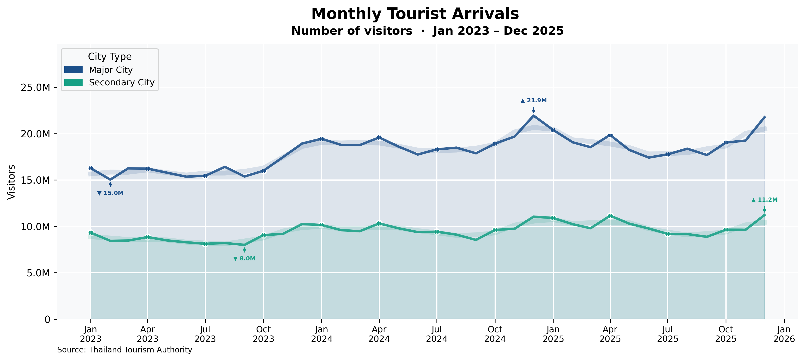

<strong>Figure 1A. Monthly Tourist Arrivals: Primary vs. Secondary Cities (2023–2025)</strong>

> **🔍 Analytical Deep-Dive: Successful Redistribution**
> Figure 1 proves that the "Secondary City" policy is working in terms of volume. Secondary cities (Green line) now mirror the seasonal spikes of major hubs (Blue line) perfectly. This indicates that travelers are increasingly willing to explore emerging destinations during national "High Seasons." We have successfully moved the "Footprints."

  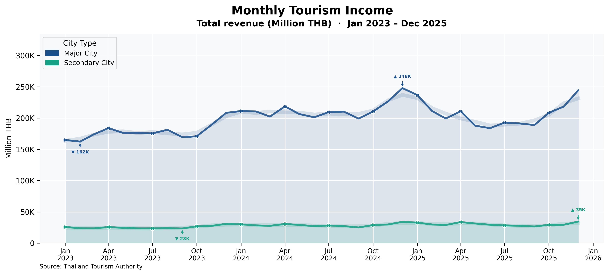

<strong>Figure 1B. Monthly Tourism Revenue: Primary vs. Secondary Cities (2023–2025)</strong>

> **🔍 Analytical Deep-Dive: The Stagnant Wealth Gap**
> Despite the arrival growth, Figure 1B reveals a staggering **3.6x Yield Gap**. Even when visitors increase, the revenue response in secondary cities is disproportionately lower. This suggests these cities currently serve as **"Transit Points"** rather than **"Destination Hubs."** 

  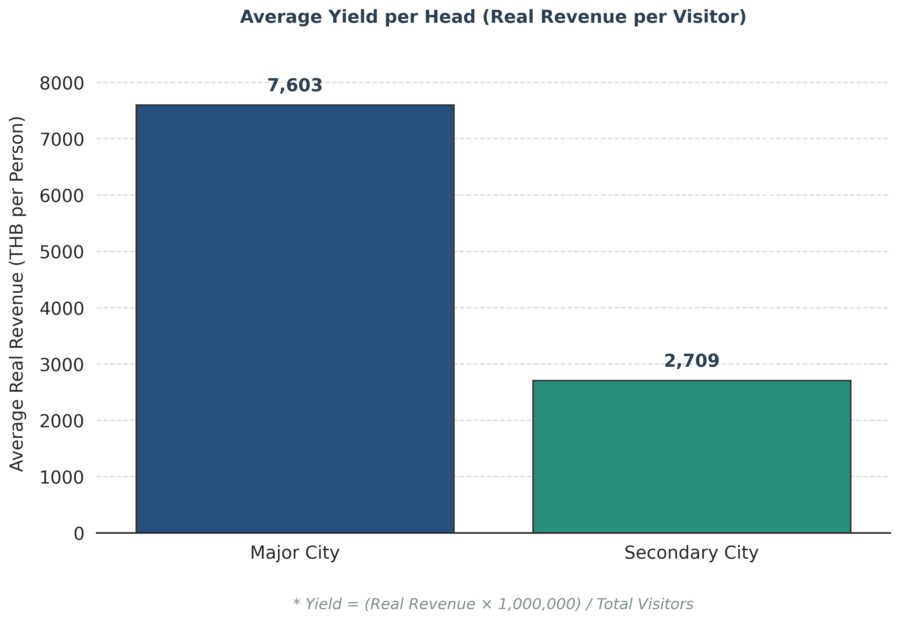

<strong>Figure 1C. Comparative Yield Efficiency: Average Spend per Head (Unit: THB/Person)</strong>

> **🔍 Analytical Deep-Dive: Decoding the Efficiency Gap**
> Figure 1C uncovers the core of the paradox. While Major Cities command a premium spend per visitor, Secondary Cities suffer from low **"Revenue Capture."** > * **The Insight:** It takes nearly **4 tourists** in a secondary city to match the economic contribution of **1 tourist** in a primary city. 
> * **Action Plan:** To bridge this gap, policy must transition from "Volume-Based" to **"Value-Based"**—focusing on increasing the length of stay and providing high-value local experiences that encourage deeper spending in the community.
---

## **02 : The Potential — The Structural Shift**
### *Market Share: Establishing a New Economic Baseline*

  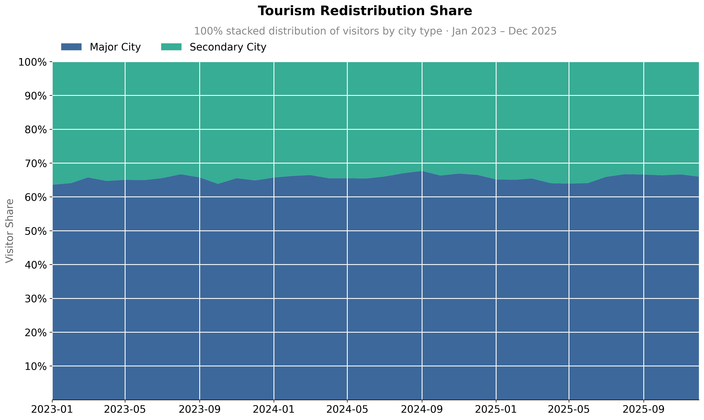

<strong>Figure 2. Market Share Distribution of Tourist Arrivals</strong>

> **🔍 Analytical Deep-Dive: A Permanent Shift**
> Unlike temporary seasonal spikes, Figure 2 displays a **Steady Expansion** of the secondary city baseline (Green Area). This is evidence of a **Structural Decentralization** in Thai tourism. Secondary cities are becoming a permanent part of the national travel "habit," creating a stable long-term opportunity for local infrastructure investment.

---

## **03 : The Planning to Action Funnel**
### *Synchronizing Timing with Conversion Efficiency*

This section bridges the gap between digital discovery and physical arrival. We analyze the **Discovery Window** (Timing) and the **Conversion Matrix** (Efficiency) to identify structural bottlenecks in the traveler's journey.

  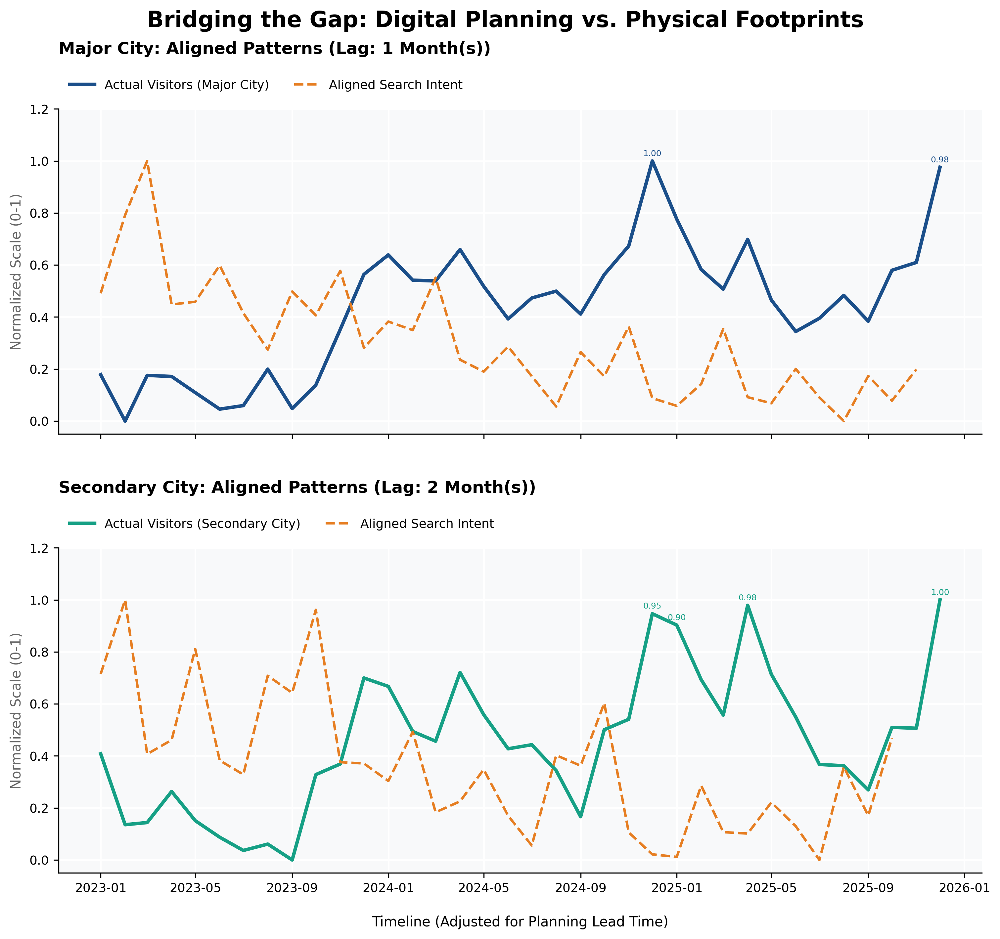

<strong>Figure 3A. Predictive Lead-Time Analysis: The Discovery Window</strong>

> **🔍 Analytical Deep-Dive: The "Explorer" planning cycle**
> * **Major Cities (1-Month Lag):** Reflects **"Spontaneous Travel."** High accessibility and familiarity allow travelers to visit almost immediately after searching.
> * **Secondary Cities (2-Month Lag):** Reflects an **"Explorer Culture."** Travelers require a significantly longer **60-day planning window** to research logistics for emerging destinations. 
> * **Strategic Takeaway:** Marketing spend for secondary cities must be front-loaded **at least 8 weeks** prior to peak seasons to capture this initial search intent.

---
### *From Search to Arrival: Measuring the Efficiency of Intent*

Knowing *when* travelers search is only half the equation — the other half is whether that interest actually converts into a physical visit. This section maps each province's **digital search intensity** against its **actual arrival volume** to expose critical conversion gaps. By identifying where intent breaks down, we can pinpoint the structural barriers that prevent online interest from becoming real economic activity.

  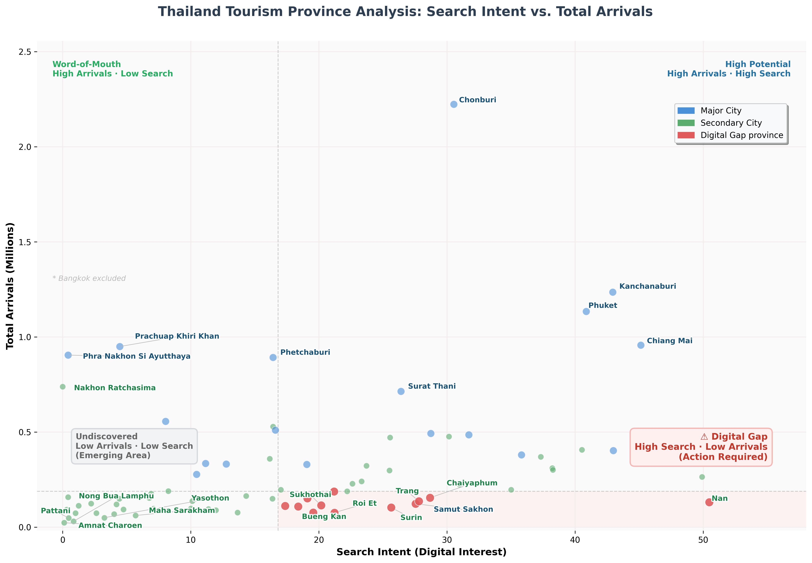

<strong>Figure 3B. Strategic Matrix: Search Intent (Digital) vs. Actual Arrivals (Physical)</strong>

> **🔍 Analytical Deep-Dive: The "Digital Gap" Analysis**
> Using a **Median-based Quadrant Analysis** (excluding Bangkok for statistical integrity), we evaluate the conversion efficiency of each province:
>
> 1. **⚠ The Digital Gap (Red Zone):** These are "Digital Winners" but "Physical Losers." High search intent does not translate to arrivals. This indicates a **Structural Bottleneck**—travelers want to go, but face barriers such as limited transport frequency or insufficient accommodation.
> 2. **💎 Word-of-Mouth (Top-Left):** Provinces where physical popularity exceeds digital planning. These "Hidden Gems" rely on proximity or direct peer recommendations.
> 3. **🚀 High Potential (Top-Right):** Winners that successfully convert high digital interest into high volume.

### **💡 Combined Strategic Action Plan**
* **For Secondary Cities:** Align campaigns with the **8-week Discovery Window** (from Fig 4A) to ensure your message hits when travelers are in the research phase.
* **For Digital Gap Provinces:** Shift policy from *Promotion* to **Accessibility**. Provinces like **Nan** (highlighted in red) do not need more advertising; they need improved road connectivity and transport frequency to bridge the physical gap.
* **Objective:** By optimizing the funnel—timing the campaigns right and fixing the conversion bottlenecks—we maximize the ROI of the national tourism budget.

---

## **04 : Economic Resilience — Income Stability & Risk**
### *Real Income Variance: Measuring the Quality of Growth*

Beyond tourist volume, the **Quality of Income** is defined by its consistency. We analyze the **Real Income Variance** to understand if tourism provides a steady livelihood or a high-risk gamble for local communities. We utilize the **Coefficient of Variation (CV)** as our primary risk metric.

$$CV = \frac{\sigma}{\mu} \times 100$$

  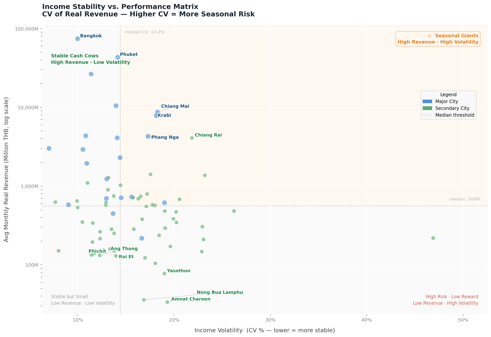

<strong>Figure 4. Stability Matrix: Revenue Performance vs. Income Volatility (CV%)</strong>

> **🔍 Analytical Deep-Dive: Decoding the "Risk-Reward" Trade-off**
> * **✅ Stable Cash Cows:** Provinces in the top-left provide consistent, year-round income—the gold standard for sustainability.
> * **⚠️ Seasonal Giants:** High-revenue provinces (Top-Right) that are heavily dependent on peak seasons, creating high financial risk for local SMEs during the off-season.
> * **Strategic Takeaway:** Policy must focus on "Flattening the Curve" for Seasonal Giants to ensure year-round economic resilience.

### **💡 Key Takeaways: From Volatility to Resilience**

* **Quality over Quantity:** A high Real Revenue figure is misleading if the **CV is above 50%**. Such provinces rely on "Peak Season spikes," which create financial instability and labor fluctuations for local communities.
* **The "Stable Cash Cow" Benchmark:** Provinces in the **Top-Left quadrant** are the strategic models for Thailand. They successfully decouple tourism from seasonal limitations, ensuring a resilient, year-round flow of wealth.
* **The SME Safety Net:** High volatility (High CV) is a primary cause of business failure for local SMEs. Reducing income variance is a direct way to improve the survival rate of grassroots tourism entrepreneurs.
* **Scaling Strategy for Secondary Cities:** Provinces in the **"Stable but Small"** (Bottom-Left) category are the safest targets for immediate investment. Their low volatility suggests they have the structural readiness to handle increased volume without falling into the "Seasonal Trap."
---

## **05 : Regional Seasonality — The Precision Window**

### *Timing by Geography: When to Intervene?*

This section analyzes the seasonal patterns of tourism across Thailand’s regions (with Bangkok and the metropolitan area analyzed separately) to identify optimal periods for strategic intervention. By examining visitor trends at the regional level, we can align marketing and policy actions with the actual planning cycles of travelers, maximizing the effectiveness of resource allocation.

  

<strong>Figure 5. Visitor Trends by Region (2023–2025)</strong>

The data reveal distinct seasonal profiles for each region:

> - **North:** Experiences a pronounced peak from November to January, driven by cooler weather and cultural events. Strategic focus should be on intensifying promotional activities in the months leading up to this period, with approximately 70% of the annual marketing budget allocated to Q3.
> - **South:** Demonstrates stable, year-round visitor flows, reflecting its appeal as a perennial destination. Maintaining a consistent digital presence is recommended to capture ongoing demand.
> - **Northeast:** Characterized by sharp increases during festival periods, indicating a "pulsing" pattern tied to local events (e.g., the Bun Bang Fai Rocket Festival in Yasothon(May)). Short, targeted advertising campaigns with a 6-week lead time are most effective here.

| 🌏 Region | 🗓️ Peak Window | 📊 Stability Profile | 🎯 Strategic Action |
| :--- | :---: | :--- | :--- |
| **North** | `Nov — Jan` | **Seasonal Sprint** | `Front-load 70%` of budget into Q3 |
| **South** | `Year-round` | **Resilient Marathon** | Maintain `Always-on` digital presence |
| **Northeast** | `Festival Peaks` | **Cultural Pulsing** | `Short-burst` ads (6-week lead) |

By tailoring strategies to these regional dynamics, policymakers can enhance the impact of tourism initiatives, ensuring that interventions are both timely and regionally relevant.

## **06 : The Reality — Real Wealth Generation**

### *Purchasing Power: The Inflation-Adjusted Truth*

To rigorously assess the economic impact of tourism on local communities, this section moves beyond nominal revenue figures and instead evaluates **Real Revenue**—adjusted for the Consumer Price Index (CPI)—to reflect true purchasing power over time.

$$Real\ Revenue = \left( \frac{Nominal\ Revenue}{CPI} \right) \times 100$$

  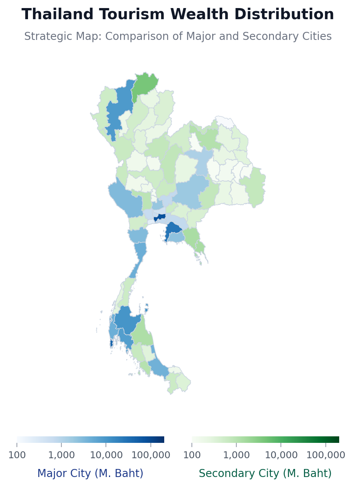

<strong>Figure 6A. Geographic Distribution of CPI-Adjusted Tourism Revenue (2023–2025)</strong>

>Figure 6A visually demonstrates that tourism-generated wealth is predominantly concentrated within established **Economic Corridors** (Central, Southern, and Eastern Seaboards), while many secondary cities in the North-East and deep North remain in **revenue cold-spots**. This spatial disparity highlights the limitations of digital promotion alone and underscores the necessity for policies that enhance **physical connectivity** and accessibility to major tourism hubs.

  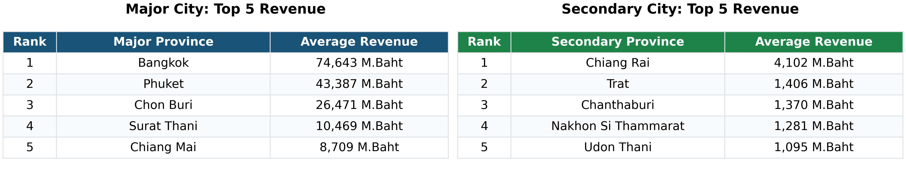

<strong>Figure 6B. Performance Ranking: Major vs. Secondary City Leaders (Average 2023–2025)</strong>

>Figure 6B further contextualizes these findings by ranking provinces according to CPI-adjusted tourism revenue. The data reveal a pronounced gap: **Bangkok** generates 18 times the revenue of the leading secondary city, yet **Chiang Rai** stands out as a strategic model, outperforming its peers by a factor of three. This suggests that secondary cities can achieve significant economic scale by leveraging unique cultural assets and cross-border linkages, provided that structural barriers to access are addressed.

---

<h2 id="macro-micro">07 : Macro-Micro Comparison — The Great Divide ⚖️</h2>

### *Benchmarking Secondary Cities against National Hubs*

After conducting a deep dive into the economic performance of the 55 secondary provinces, it is essential to contextualize these findings within the national landscape. By benchmarking them against Thailand’s primary tourism hubs (Major Cities), we can clearly visualize the "Great Divide" in terms of revenue scale and market composition.

  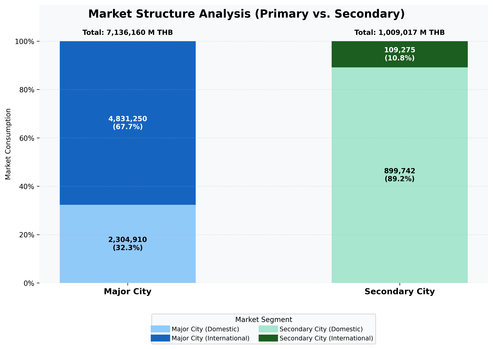

<strong>Figure 7A. Market Structure Analysis (Primary vs. Secondary)
</strong>

> **🔍 Structural Insight: The Foreigner Gap**
>
>* **Primary Hubs (Global Magnets):** Major cities derive the majority of their income from **International Revenue (67.7%)**, serving as gateways that attract substantial spending from high-value global travelers.
>* **Secondary Cities (Domestic Backbone):** In contrast, secondary cities depend predominantly on **Domestic Travelers (89.2%)**. This highlights a pronounced "Branding Gap," showing that these destinations have yet to establish a strong presence in the global tourism market.

  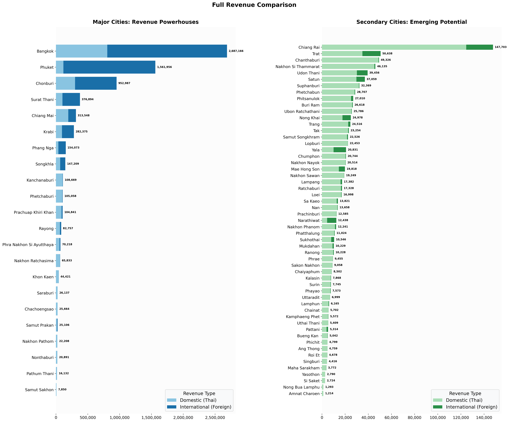

<strong>Figure 7B. Major vs. Secondary Cities: Total Revenue Comparison

</strong>

> **🔍 Scale Insight: The 8.2x Multiplier**
>
>* **Economic Dominance:** Revenue generation is highly concentrated. A handful of primary hubs (Bangkok, Phuket, Chonburi) produce revenue that far exceeds the combined total of all secondary cities, with an overall gap of approximately **8.2x**.
>* **The "Chiang Rai" Benchmark:** Notably, **Chiang Rai** emerges as the top secondary city, with a revenue structure increasingly resembling that of primary hubs. It serves as a **"Success Template"** for other secondary provinces aspiring to enhance their economic performance.

### **🎯 Strategic Takeaway**
Policy development should avoid turning secondary cities into replicas of Bangkok. Instead, efforts should focus on **strategically increasing their share of Foreign Revenue**. This will foster greater economic resilience and higher yield per visitor, while maintaining the distinctive local character of secondary destinations.

---

## **08 : Strategic Portfolio Analysis 📊**

### *Benchmarking the Economic DNA of 55 Cities*

By integrating key metrics—**Yield, Conversion, and Stability**—this section transitions from descriptive analysis to actionable strategy. Thailand’s 55 provinces are systematically categorized into a strategic portfolio using **median-based thresholds**, providing a robust framework for prioritizing national investment and policy interventions.

  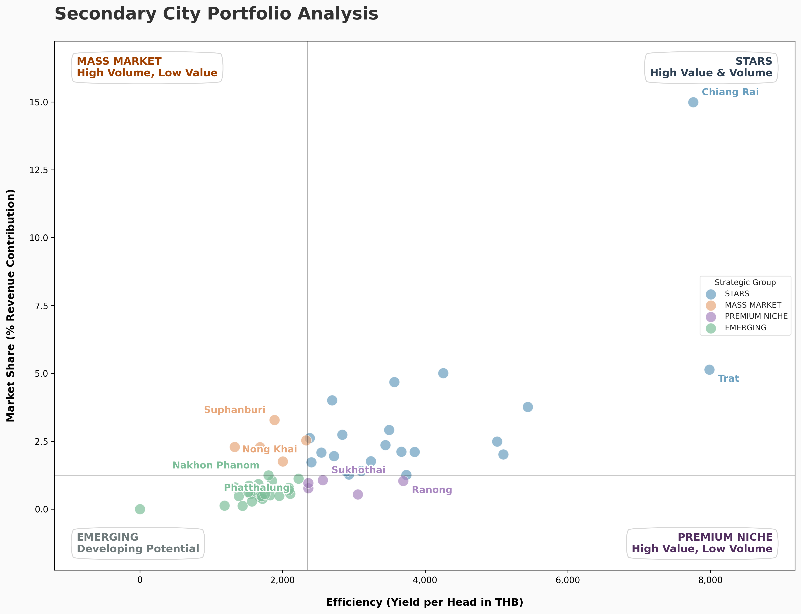

<strong>Figure 8. Strategic Positioning of 55 Cities based on Efficiency (Yield) and Market Share</strong>

> **🔍 Analytical Deep-Dive: Decoding the Quadrants**
> * **⭐ STARS:** Provinces such as **Buri Ram** and **Sra Kaeo** exemplify the ideal balance of high visitor volume and high spending per head. These regions have successfully scaled their tourism economies while maintaining strong value capture, making them models for sustainable growth.
> * **💎 PREMIUM NICHE:** These are the "Quality Leaders"—provinces that, despite lower visitor numbers, achieve high economic returns by attracting high-spending, niche market segments. Their success demonstrates that exclusivity and targeted branding can rival mass tourism in economic impact.
> * **🚜 MASS MARKET:** Provinces in this group attract large numbers of visitors but struggle to convert this volume into substantial local economic benefit. The key strategic imperative here is to enhance local "spending touchpoints" and develop offerings that increase per-visitor value.
> * **🌱 EMERGING:** Representing the "Growth Frontier," these provinces are in the early stages of tourism development. Policy should focus on building foundational infrastructure, strengthening brand identity, and fostering conditions for future growth.

---

## **09 : Foreign Tourist Analysis 🌍**

### *Top 10 Source Countries for Thailand's Inbound Tourism*

A nuanced understanding of Thailand’s inbound tourism landscape requires a detailed analysis of the top 10 source countries. This section examines both annual and monthly trends from 2023 to 2025, providing actionable insights for market targeting, policy design, and infrastructure planning.

  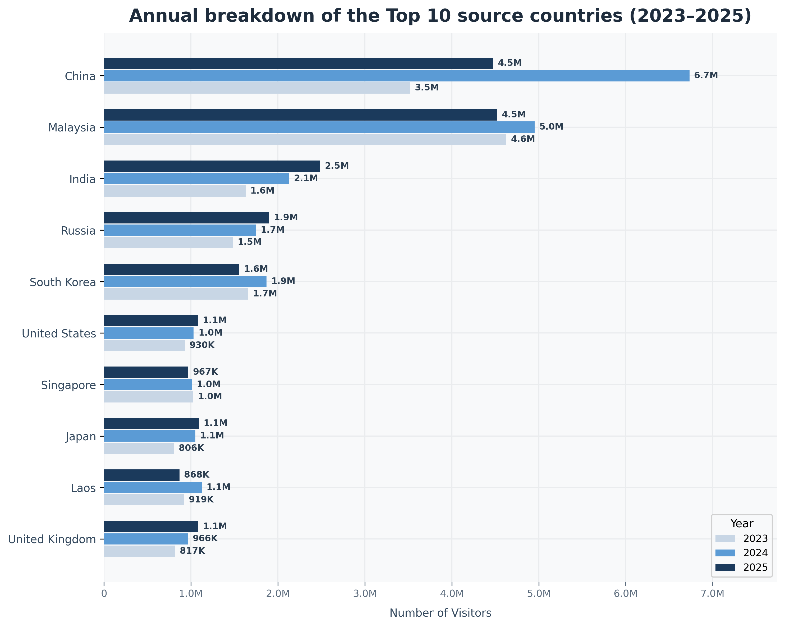

<strong>Figure 9A. Annual breakdown of the Top 10 source countries (2023–2025)</strong>

> **🔍 Key Insight:**
> * **China** remains the dominant source market, underscoring the robust recovery of Chinese outbound tourism and its critical role in Thailand’s visitor economy.
> * **Malaysia** and **India** consistently occupy leading positions, driven by geographic proximity, cultural ties, and expanding middle-class travel demand.
> * **South Korea** and **Russia** exhibit pronounced seasonal patterns, presenting opportunities for precisely timed marketing campaigns and tailored product offerings.

  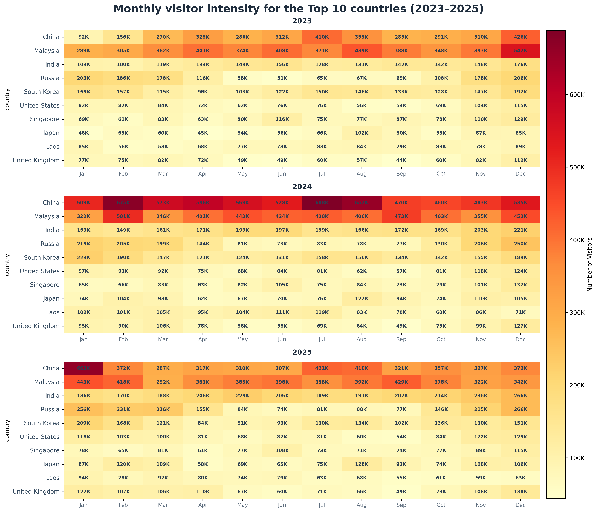

<strong>Figure 9B. Monthly visitor intensity for the Top 10 countries (2023–2025)</strong>

> **🔍 Seasonality Insight:**
> * The heatmap reveals distinct **seasonal peaks**: Chinese arrivals surge during Q1 (Lunar New Year) and Q4 (Golden Week), while European markets reach their highest levels during the Northern Hemisphere winter (November–February).
> * **Sustained year-over-year growth** is evident across most top markets, confirming the resilience and ongoing recovery of Thailand’s international tourism sector.

### **🎯 Policy Implications**
> * **Market Diversification:** Proactively reduce reliance on China by accelerating growth from **India, South Korea, and ASEAN** countries to mitigate single-market risk.
> * **Seasonal Campaign Timing:** Implement country-specific marketing campaigns **60–90 days** ahead of peak travel periods (Q1 for China, Nov–Feb for Europe/Russia).
> * **Visa & Access Policy:** Expand visa-free entry and direct flight options for **India and South Korea**, both of which show strong and accelerating growth trajectories.
> * **Capacity Planning:** Strategically allocate resources and infrastructure in **Q4–Q1** when multiple top markets converge, especially at major gateway provinces.
> * **Secondary City Routing:** Promote multi-city itineraries for **South Korean and Japanese** tourists to increase per-trip spending and distribute benefits beyond primary hubs.

---

## **🏁 Final Research Conclusions**

The following table synthesizes the answers to the core research questions that guided this study. Each question is addressed with a concise summary of findings and a corresponding policy implication, providing a holistic view of Thailand’s tourism transformation. This structured overview highlights the most critical insights for policymakers and stakeholders seeking to foster sustainable, equitable, and resilient tourism-driven growth.

| 🔍 Research Question (RQ) | 📝 Synthesis of Findings | 💡 Policy Implication |
| :--- | :--- | :--- |
| **1. Are growth rates sustainable?** | Secondary cities now exhibit growth rates on par with primary hubs, indicating a durable shift in travel behavior. | Recognize secondary cities as integral to the national tourism portfolio. |
| **2. Has market redistribution occurred?** | Market share is broadening, with value increasingly captured outside traditional centers. | Prioritize strategies that enhance value retention in emerging destinations. |
| **3. Is income quality improving?** | A significant gap persists in real income quality (3.6x lower in secondary cities). | Shift focus from volume to yield, emphasizing revenue per visitor. |
| **4. Can digital signals predict arrivals?** | A consistent two-month lag exists between digital intent and actual visits. | Time marketing interventions 60 days ahead of peak periods. |
| **5. Are real income gains widespread?** | Gains are selective and risk-dependent; only provinces with stable income profiles see sustained benefits. | Use "Stable Cash Cow" provinces as models to reduce volatility elsewhere. |

---

**Synthesis:** The true measure of Thailand’s tourism advancement lies not in arrival counts, but in the generation of real, inflation-adjusted wealth and the promotion of economic stability for local communities.

---